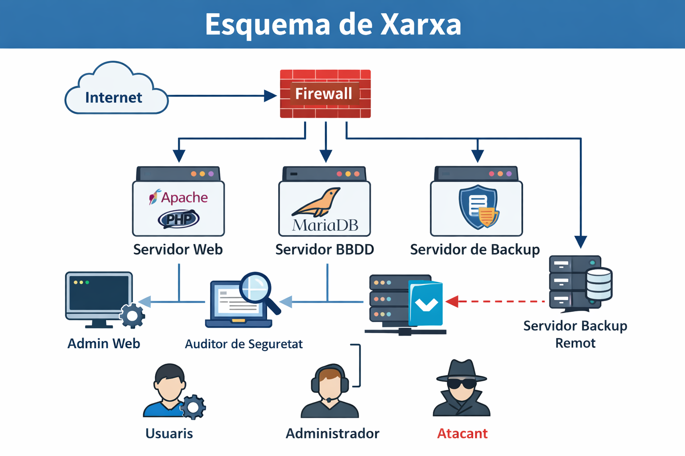

# Documentación Técnica del Servidor Corporativo (SRE-Docs)

## Visión general

Este portal centraliza la documentación técnica del despliegue de un servidor corporativo basado en un entorno LAMP/LEMP. 

Siguiendo la filosofía SRE (Ingeniería de Fiabilidad), el objetivo principal de este sitio es garantizar la **transferencia de conocimiento** y la **continuidad del negocio**. De este modo, nos aseguramos de que cualquier autoridad técnica o personal de administración de sistemas pueda comprender, mantener, auditar y replicar la infraestructura en cuestión de minutos.

## Equipo responsable

El diseño, despliegue y documentación de este proyecto ha sido llevado a cabo por el **Grupo B**, trabajando bajo la metodología ágil SCRUM para garantizar la eficiencia y estandarización del proceso. 

Los miembros del equipo y sus áreas de especialización son:

* **Rende:** Coordinación SCRUM, revisión general del proyecto y estructuración del portal web (`index.md`).
* **Joan:** Despliegue estandarizado y configuración técnica de los servicios web y bases de datos (`servidores.md`).
* **Ingrid:** Administración del sistema, gestión de roles y jerarquía de permisos de los usuarios (`usuarios.md`).
* **Iván:** Fortificación del servidor (*Hardening*), medidas de seguridad, gestión de licencias y bibliografía (`seguridad.md`).

## Alcance del proyecto

La documentación de este portal está dividida en módulos atómicos que incluyen:

* **Instalación de servicios:** Configuración del servidor y despliegue de los servicios principales.
* **Gestión de usuarios:** Estructura de roles, grupos y permisos del sistema.
* **Seguridad (Hardening):** Medidas de protección aplicadas al servidor (Firewall, SSH, puertos).
* **Topología de red:** Esquema visual lógico de la infraestructura.

## Esquema de la red

A continuación se detalla la topología de la red corporativa diseñada para este despliegue, mostrando la interacción entre el entorno de internet, el firewall perimetral y los diferentes servidores internos (Web, Base de Datos y Backup):

